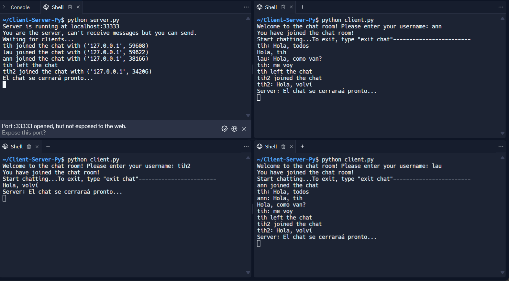

# Client-Server-Py

**Author:** Tihamer Aldana

**Description:**
This project showcases a Server-Client model developed in Python. The model initiates a server and allows for initiating
chat amongst clients.

**How to Start the Server:**

- Run `python server.py`. The server will start with the already defined host and port.

**How to Chat on the Client:**

- Open a new terminal window for each client.
- Run `python client.py`.
- You can then start chatting amongst clients.

**Here is a use example at replit:**

If you don´t want to install it, you can test it at replit, like this:

this is the link:
https://replit.com/@Tihamer-k/Client-Server-Py

**Note:**

- The predefined limit for clients is 3. However, this can be modified based on preference.
- Also is recommended to use the python versión >= 3.11
- remember to exit the chat, only type "exit chat"
